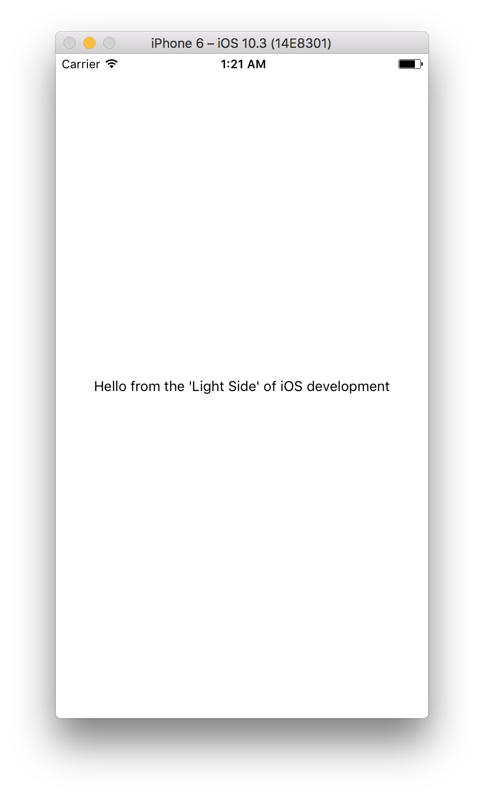

A demo **react-native** project which aim is to show a way of native to js communication **without** use of **'RCTEventEmitter'**.

### Android:
```java
MessagesModule jsModule = context.getJSModule(MessagesModule.class);

jsModule.sendMessage("Hello from the 'Light Side' of android development");
```

### iOS:
```obj-c
MessagesModule *module = [bridge moduleForClass: [MessagesModule class]];

[module sendMessage:@"Hello from the 'Light Side' of iOS development"];
```
### Js:
```js
'use strict';

export default class MessagesModule {
    sendMessage(message) {
        this.listener.onMessageFromNative(message);
    }
}
```

### Screenshots
<p align="center">
  <a href="art/ios.png"></a>
  <a href="art/android.png"></a>
</p>